# 绾㈣憽钀勯厭璐ㄩ??? 
### by 鍗㈡枃濞?
---

```{r prepare, echo=FALSE}
library(ggplot2)
library(GGally)
library(grid)
```

```{r load data, echo=FALSE}
# 鍔犺浇鏁版嵁
origin_wine <- read.csv('wineQualityReds.csv',sep=',')
#绗竴鍒楁病鏈変粈涔堢敤锛屽垹鎺?
wine <- origin_wine[,c(2:13)]

```


## 鏁版嵁鎻忚堪
```{r summary, echo=FALSE}
str(wine)
summary(wine)
#浣跨敤ggpairs缁樺埗鏁翠綋鍥惧???,鐪嬩笉鍑轰粈涔堟???
ggpairs(wine)
```

'data.frame':	1599 obs. of  12 variables:
 $ fixed.acidity       : num  7.4 7.8 7.8 11.2 7.4 7.4 7.9 7.3 7.8 7.5 ...
 $ volatile.acidity    : num  0.7 0.88 0.76 0.28 0.7 0.66 0.6 0.65 0.58 0.5 ...
 $ citric.acid         : num  0 0 0.04 0.56 0 0 0.06 0 0.02 0.36 ...
 $ residual.sugar      : num  1.9 2.6 2.3 1.9 1.9 1.8 1.6 1.2 2 6.1 ...
 $ chlorides           : num  0.076 0.098 0.092 0.075 0.076 0.075 0.069 0.065 0.073 0.071 ...
 $ free.sulfur.dioxide : num  11 25 15 17 11 13 15 15 9 17 ...
 $ total.sulfur.dioxide: num  34 67 54 60 34 40 59 21 18 102 ...
 $ density             : num  0.998 0.997 0.997 0.998 0.998 ...
 $ pH                  : num  3.51 3.2 3.26 3.16 3.51 3.51 3.3 3.39 3.36 3.35 ...
 $ sulphates           : num  0.56 0.68 0.65 0.58 0.56 0.56 0.46 0.47 0.57 0.8 ...
 $ alcohol             : num  9.4 9.8 9.8 9.8 9.4 9.4 9.4 10 9.5 10.5 ...
 $ quality             : int  5 5 5 6 5 5 5 7 7 5 ...
 
鏁版嵁闆嗘湁1599涓瀵熷€硷???12涓彉閲忋€?


## 鍗曞彉閲忓垎????

### 绾㈤厭璐ㄩ噺鍒嗘???
```{r quality, echo=FALSE}

ggplot(data=wine,aes(quality))+
  geom_histogram()

summary(wine$quality)
```

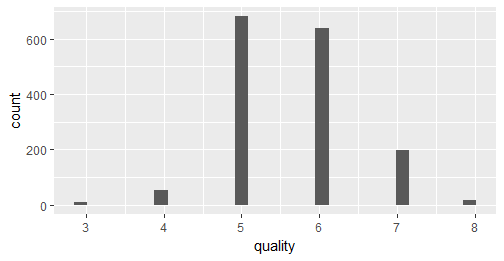

鏌ョ湅璐ㄩ噺鐨勬煴褰㈠浘锛岀湅鍑烘牱鏈腑璐ㄩ噺鐨勫垎甯冨舰鐘剁被浼兼鎬佸垎甯冿紝璐ㄩ噺鍒嗘暟涓棿鐨勬瘮杈冨???

### 闈炴尌鍙戞€ч吀
```{r fixed.acidity, echo=FALSE}

ggplot(data=wine,aes(fixed.acidity))+
  geom_histogram() +
  scale_x_continuous(breaks=c(4,5,6,7,8,9,10,11,12,13,15,16))

summary(wine$fixed.acidity)
```


   Min. 1st Qu.  Median    Mean 3rd Qu.    Max. 
   4.60    7.10    7.90    8.32    9.20   15.90
   
闈炴尌鍙戞€ч吀锛屽???4.6g/dm^3????15.9g/dm^3涔嬮棿锛屼腑浣嶆暟鏄?7.9g/dm^3锛屽钩鍧囧€兼槸8.32g/dm^3???? 


### 鎸ュ彂閰?
```{r volatile.acidity, echo=FALSE}

ggplot(data=wine,aes(volatile.acidity))+
  geom_histogram()

summary(wine$volatile.acidity)
```
 
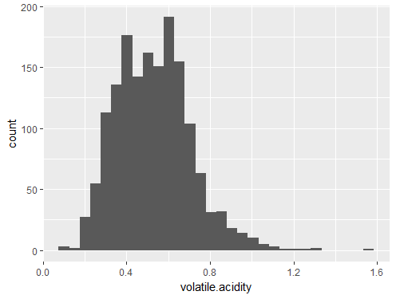

   Min. 1st Qu.  Median    Mean 3rd Qu.    Max. 
 0.1200  0.3900  0.5200  0.5278  0.6400  1.5800 

鎸ュ彂鎬ч吀锛屽???0.12g/dm^3????1.58g/dm^3涔嬮棿锛屼腑浣嶆暟鏄?0.52g/dm^3锛屽钩鍧囧€兼槸0.53g/dm^3????


### 鏌犳閰?
```{r citric.acid, echo=FALSE}

ggplot(data=wine,aes(citric.acid))+
  geom_histogram()

summary(wine$citric.acid)
```
 
 

    Min. 1st Qu.  Median    Mean 3rd Qu.    Max. 
  0.000   0.090   0.260   0.271   0.420   1.000 

鏌犳閰革紝????0g/dm^3????1g/dm^3涔嬮棿锛屼腑浣嶆暟鏄?0.26g/dm^3锛屽钩鍧囧€兼槸0.27g/dm^3????

涓夌閰革紝鏌犳閰稿拰鎸ュ彂閰稿惈閲忔瘮闈炴尌鍙戦吀鍚噺灏戝緱澶氾紝鎸ュ彂閰稿拰闈炴尌鍙戦吀閮芥槸绫讳技姝ｆ€佺殑鍒嗗竷锛屾煚妾吀鍚噺浣庣殑鍋忓锛屽惈閲忛珮鐨勫亸灏戙????

### 娈嬬暀绯栧???
```{r residual.sugar, echo=FALSE}

ggplot(data=wine,aes(residual.sugar))+
  geom_histogram()

summary(wine$residual.sugar)
```


   Min. 1st Qu.  Median    Mean 3rd Qu.    Max. 
  0.900   1.900   2.200   2.539   2.600  15.500 

娈嬬暀绯栧垎锛屽湪0.9g/dm^3????15.5g/dm^3涔嬮棿锛屼腑浣嶆暟鏄?2.2g/dm^3锛屽钩鍧囧€兼槸2.54g/dm^3????
娈嬬暀绯栧垎鍛堢幇闀垮熬鍒嗗竷锛屽亸浣庣殑寰堝锛屽亸楂樼殑寰堝皯锛岀孩閰掓畫鐣欑硸鍒嗗ぇ閮ㄥ垎閮藉湪2.6浠ヤ笅锛屼粠绗笁鍥涘垎浣嶆暟鍙互鐪嬪嚭鏉ャ€?10浠ヤ笂鍙湁鍑犱釜绂绘暎鐐癸紝闇€瑕佽繘涓€姝ュ垎鏋愩€?

### 姘寲鐗?
```{r chlorides, echo=FALSE}

ggplot(data=wine,aes(chlorides))+
  geom_histogram()

summary(wine$chlorides)
```

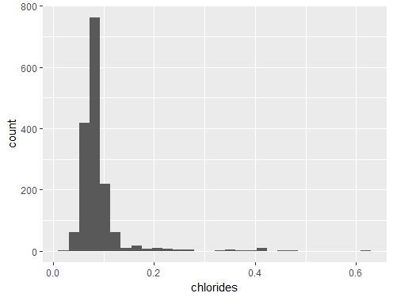

   Min. 1st Qu.  Median    Mean 3rd Qu.    Max. 
0.01200 0.07000 0.07900 0.08747 0.09000 0.61100 

姘寲鐗╋紝????0.012g/dm^3????0.611g/dm^3涔嬮棿锛屼腑浣嶆暟鏄?0.079g/dm^3锛屽钩鍧囧€兼槸0.087g/dm^3????

姘寲鐗╀篃鍛堢幇闀垮熬鍒嗗竷锛屽ぇ閮ㄥ垎閮藉湪0.09浠ヤ笅銆?0.3浠ヤ笂灏卞彧鏈夊嚑涓鏁ｇ偣銆?


### 娓哥浜屾哀鍖栫???
```{r free.sulfur.dioxide, echo=FALSE}

ggplot(data=wine,aes(free.sulfur.dioxide))+
  geom_histogram()

summary(wine$free.sulfur.dioxide)
```

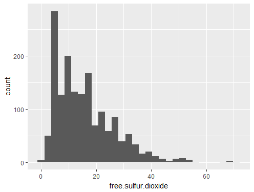

   Min. 1st Qu.  Median    Mean 3rd Qu.    Max. 
   1.00    7.00   14.00   15.87   21.00   72.00 

娓哥浜屾哀鍖栫～锛屽湪1mg/dm^3????72mg/dm^3涔嬮棿锛屼腑浣嶆暟鏄?14mg/dm^3锛屽钩鍧囧€兼槸15.87mg/dm^3????

### 鎬讳簩姘у寲纭噺
```{r total.sulfur.dioxide, echo=FALSE}

ggplot(data=wine,aes(total.sulfur.dioxide))+
  geom_histogram()
#鎺掗櫎寮傚父????
ggplot(data=wine,aes(total.sulfur.dioxide))+
  geom_histogram()+
  scale_x_continuous(lim=c(0,200))

summary(wine$total.sulfur.dioxide)
```


   Min. 1st Qu.  Median    Mean 3rd Qu.    Max. 
   6.00   22.00   38.00   46.47   62.00  289.00 

鎬讳簩姘у寲纭噺锛屽???6mg/dm^3????289mg/dm^3涔嬮棿锛屼腑浣嶆暟鏄?38mg/dm^3锛屽钩鍧囧€兼槸46.47mg/dm^3????

缁忚繃鏌ヨ祫鏂欙紝娓哥浜屾哀鍖栫～鍜屾€讳簩姘у寲纭槸鏈夊叧绯荤殑锛屾€讳簩姘у寲纭槸娓哥浜屾哀鍖栫～鍜岀粨鍚堜簩姘у寲纭殑缁煎悎锛屼袱鑰呭垎甯冪浉浼硷紝鍚～閲忎綆鐨勫亸澶氾紝鍚～閲忚秺楂樼殑锛屾暟閲忚秺灏戙€?300宸﹀彸鏈変袱涓鏁ｇ偣锛岀寽鎯虫槸鍚︽槸寮傚父鍊笺€傛煡璧勬枡鍙戠幇锛屽彂閰甸厭鐨勬€讳簩姘у寲纭惈閲忎笉搴旇秴杩?250mg/dm^3,鎵€浠ワ紝灏嗚繖浜涜秴鏍囦簩姘у寲纭殑绾㈤厭锛堟垨鑰呰寮傚父鍊硷級涓嶆槸鎴戜滑鐮旂┒鐨勮寖鍥达紝鍥犳灏嗗紓甯稿€煎幓鎺夈????
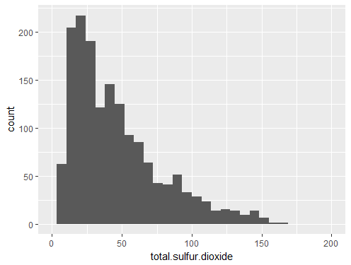


### 瀵嗗???
```{r density, echo=FALSE}

ggplot(data=wine,aes(density))+
  geom_histogram()

summary(wine$density)
```


   Min. 1st Qu.  Median    Mean 3rd Qu.    Max. 
 0.9901  0.9956  0.9968  0.9967  0.9978  1.0037 
 
 瀵嗗害锛屽湪0.99g/cm^3????1g/cm^3涔嬮棿锛屼腑浣嶆暟鏄?30.9968g/cm^3锛屽钩鍧囧€兼槸0.9967g/cm^3????
 
 瀵嗗害涔熸槸鍛堢幇姝ｆ€佸垎甯冿紝绾㈤厭鐨勫瘑搴﹂兘????1闄勮繎銆?
 
### pH
```{r pH, echo=FALSE}

ggplot(data=wine,aes(pH))+
  geom_histogram()

summary(wine$pH)
```
 
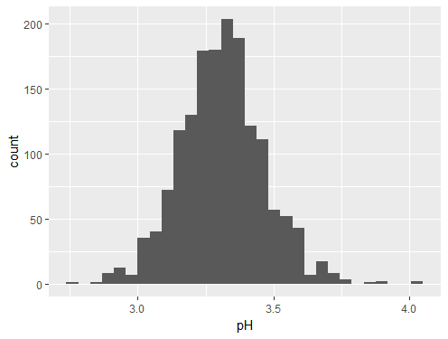
 
    Min. 1st Qu.  Median    Mean 3rd Qu.    Max. 
  2.740   3.210   3.310   3.311   3.400   4.010 
 
 
 pH锛屽???2.74????4.01涔嬮棿锛屼腑浣嶆暟鏄?3.31锛屽钩鍧囧€兼槸3.311????
 鍙互鐪嬪嚭ph鍛堥吀鎬э紝閰告€ф瘮杈冨己锛宲h涔熷憟杩戜技姝ｆ€佸垎甯?
 
  
### 纭吀????
```{r sulphates, echo=FALSE}

ggplot(data=wine,aes(sulphates))+
  geom_histogram()

summary(wine$sulphates)
```
 
 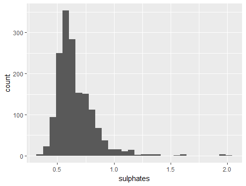
 
    Min. 1st Qu.  Median    Mean 3rd Qu.    Max. 
 0.3300  0.5500  0.6200  0.6581  0.7300  2.0000 
 
 纭吀鐩愶紝鍦?0.33g/dm^3????2g/dm^3涔嬮棿锛屼腑浣嶆暟鏄?0.62g/dm^3锛屽钩鍧囧€兼槸0.658g/dm^3????
 纭吀鐩愶紝澶ч儴鍒嗗湪1.0浠ヤ笅锛?1.5浠ヤ笂灏卞彧鏈夊嚑涓鏁ｇ偣銆?

### 閰掔簿娴撳害
```{r alcohol, echo=FALSE}

ggplot(data=wine,aes(alcohol))+
  geom_histogram() +
  scale_x_continuous(breaks=c(8,9,10,11,12,13,15))

summary(wine$alcohol)
```


   Min. 1st Qu.  Median    Mean 3rd Qu.    Max. 
   8.40    9.50   10.20   10.42   11.10   14.90
閰掔簿搴︽暟????8.4%????14.9%涔嬮棿锛屼腑浣嶆暟鏄?10.2%锛屽钩鍧囧€兼槸10.42%???? 

### 鍗曞彉閲忓垎鏋愬皬缁?
澶ч儴鍒嗗彉閲忛兘鏄憟鐜版鎬佸垎甯冿紝涓€閮ㄥ垎鍙橀噺鍛堢幇闀垮熬鍒嗗竷锛岃€屼笖闀垮熬鍒嗗竷涓€閮ㄥ垎鐐规槸绂绘暎鐨勶紝鎵€鏈夊彉閲忓湪鍋忛珮鐨勫惈閲忎笂閮芥湁鍑犱釜鍋忕涓昏閮ㄥ垎鐨勭壒渚嬬鏁ｇ偣锛屼笉绠℃槸浠€涔堝垎甯冿紝鏄寚绾㈤厭鏍锋湰閲岋紝涓嶇鎬庢牱閮芥湁鏌愮鍚噺瓒呮爣鐨勬牱鏈悧銆?


 
## 鍙屽彉閲忓垎????
### 闈炴尌鍙戦吀鍜岃川閲忓垎????
```{r , echo=FALSE}
fa_q <- ggplot(data=wine,aes(x=fixed.acidity,y=quality))+
  geom_line(stat = 'summary', fun.y = mean, color='red')+
  geom_smooth()+
  coord_flip()

q_fa <- ggplot(data=wine,aes(x=quality,y=fixed.acidity))+
  geom_point(alpha = 0.3,position='jitter')+
  geom_line(stat = 'summary', fun.y = mean, color='red')

grid.newpage()
pushViewport(viewport(layout = grid.layout(1, 2)))
print(q_fa, vp=viewport(layout.pos.row=1, layout.pos.col=1))
print(fa_q, vp=viewport(layout.pos.row=1, layout.pos.col=2))

#鐩稿叧绯绘暟寰堜???0.1240516 
cor.test(wine$quality, wine$fixed.acidity, method = "pearson")

```


浠庡浘涓彲浠ョ湅鍒帮紝璐ㄩ噺鍜岄潪鎸ュ彂閰哥殑鐩稿叧鎬у彲鑳芥湁涓€鐐规鐩稿叧锛屼换浣曡川閲忕殑绾㈤厭锛屽叾闈炴尌鍙戦吀鐨勫惈閲忛兘????8宸﹀彸锛屼絾鏄秼鍔胯繕鏄川閲忛珮鐨勯潪鎸ュ彂閰稿憟涓婂崌瓒嬪娍锛岃€屼笖杩樺彲浠ョ湅鍑猴紝闈炴尌鍙戦吀鍦ㄨ緝浣庡€煎拰杈冮珮鍊间笂鍏惰川閲忕殑娉㈠姩姣旇緝澶э紝鑰屽湪涓棿鍊间笂锛屽叾璐ㄩ噺鐩稿姣旇緝绋冲畾銆傛€荤粨鏉ヨ锛岄潪鎸ュ彂閰歌緝楂樻椂锛岃櫧鐒惰川閲忔尝鍔ㄦ瘮杈冨ぇ锛屼絾鏄川閲忚繕鏄ぇ閮ㄥ垎鍋忓ソ鐨勩€?


### 鎸ュ彂閰稿拰璐ㄩ噺鍒嗘???
```{r , echo=FALSE}
va_q <- ggplot(data=wine,aes(x=volatile.acidity,y=quality))+
  geom_line(stat = 'summary', fun.y = mean, color='red')+
  geom_smooth()+
  coord_flip()

q_va <- ggplot(data=wine,aes(x=quality,y=volatile.acidity))+
  geom_point(alpha = 0.3,position='jitter')+
  geom_line(stat = 'summary', fun.y = mean, color='red')

grid.newpage()
pushViewport(viewport(layout = grid.layout(1, 2)))
print(q_va, vp=viewport(layout.pos.row=1, layout.pos.col=1))
print(va_q, vp=viewport(layout.pos.row=1, layout.pos.col=2))


ggplot(data=wine,aes(x=factor(quality),y=volatile.acidity))+
  geom_boxplot()+
  stat_summary(fun.y = mean, geom = 'point', shape=4)

#鐩稿叧绯绘暟寰堜???-0.3905578  
cor.test(wine$quality, wine$volatile.acidity, method = "pearson")

```


浠庡浘涓彲浠ョ湅鍑猴紝鎸ュ彂閰稿拰璐ㄩ噺鏈夋瘮杈冩竻鏅扮殑璐熺浉鍏筹紝璐ㄩ噺瓒婇珮锛屾尌鍙戦吀鐨勫钩鍧囧惈閲忔槸瓒婁綆鐨勶紝鎸ュ彂閰歌緝浣庢椂锛屽叾骞冲潎璐ㄩ噺杈冮珮锛屼粠绠辩嚎鍥剧湅鍑烘尌鍙戦吀鐨勫紓甯稿€艰川閲忎???3????


### 鏌犳閰稿拰璐ㄩ噺鍒嗘???
```{r , echo=FALSE}
ca_q <- ggplot(data=wine,aes(x=citric.acid,y=quality))+
  geom_line(stat = 'summary', fun.y = mean, color='red')+
  geom_smooth()+
  coord_flip()

q_ca <- ggplot(data=wine,aes(x=quality,y=citric.acid))+
  geom_point(alpha = 0.3,position='jitter')+
  geom_line(stat = 'summary', fun.y = mean, color='red')

grid.newpage()
pushViewport(viewport(layout = grid.layout(1, 2)))
print(q_ca, vp=viewport(layout.pos.row=1, layout.pos.col=1))
print(ca_q, vp=viewport(layout.pos.row=1, layout.pos.col=2))


ggplot(data=wine,aes(x=factor(quality),y=citric.acid))+
  geom_boxplot()+
  stat_summary(fun.y = mean, geom = 'point', shape=4)

#鐩稿叧绯绘暟寰堜???0.2263725 
cor.test(wine$quality, wine$citric.acid, method = "pearson")

```


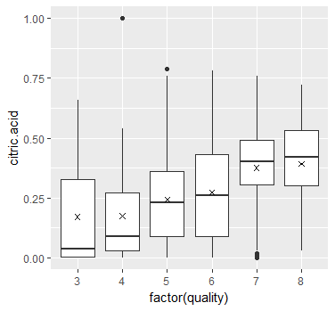

浠庡乏鍥惧彲浠ョ湅鍑猴紝闅忕潃璐ㄩ噺澧炲姞锛屾煚妾吀鐨勫钩鍧囧惈閲忔槸澧炲姞鐨勶紝鎴愭鐩稿叧锛屾煚妾吀????1鏄竴涓紓甯哥偣锛屽拷鐣ヨ寮傚父鍊硷紝鍚勭鍚噺鐨勬煚妾吀浼间箮骞冲潎璐ㄩ噺涔熸湁涓€鐐圭偣澧為暱锛屼絾鏄樊涓嶅銆?


### 鏌犳閰稿拰鍏朵粬閰?
```{r,echo= FALSE}
#鏌犳閰稿拰闈炴尌鍙戦吀涔嬮棿鐨勭浉鍏虫€э紝0.6717034 
cor.test(wine$fixed.acidity, wine$citric.acid, method = "pearson")
#鏌犳閰稿拰鎸ュ彂閰镐箣闂寸殑鐩稿叧鎬э紝-0.5524957
cor.test(wine$volatile.acidity, wine$citric.acid, method = "pearson")

cor.test(wine$volatile.acidity, wine$fixed.acidity, method = "pearson")

cor.test(wine$fixed.acidity-wine$volatile.acidity, wine$citric.acid, method = "pearson")

wine$total.acidity <- wine$fixed.acidity+wine$volatile.acidity

ggplot(data=wine,aes(x=quality,y=total.acidity))+
  geom_point(alpha = 0.3,position='jitter')+
  geom_line(stat = 'summary', fun.y = mean, color='red')
```

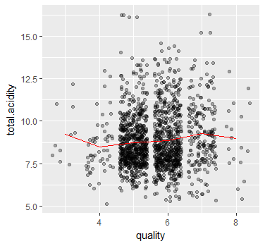

### 娈嬬暀绯栧垎鍜岃川閲忓垎鏋?
```{r , echo=FALSE}
rs_q <- ggplot(data=wine,aes(x=residual.sugar,y=quality))+
  geom_line(stat = 'summary', fun.y = mean, color='red')+
  geom_smooth()+
  coord_flip()

q_rs <- ggplot(data=wine,aes(x=quality,y=residual.sugar))+
  geom_point(alpha = 0.3,position='jitter')+
  geom_line(stat = 'summary', fun.y = mean, color='red')

grid.newpage()
pushViewport(viewport(layout = grid.layout(1, 2)))
print(q_rs, vp=viewport(layout.pos.row=1, layout.pos.col=1))
print(rs_q, vp=viewport(layout.pos.row=1, layout.pos.col=2))


ggplot(data=wine,aes(x=factor(quality),y=residual.sugar))+
  geom_boxplot()+
  stat_summary(fun.y = mean, geom = 'point', shape=4)

#鐩稿叧绯绘暟寰堜???0.01373164
cor.test(wine$quality, wine$residual.sugar, method = "pearson")

```


鐪嬭捣鏉ユ病鏈変粈涔堢浉鍏虫????


### 姘寲鐗╁拰璐ㄩ噺鍒嗘???
```{r , echo=FALSE}
cl_q <- ggplot(data=wine,aes(x=chlorides,y=quality))+
  geom_line(stat = 'summary', fun.y = mean, color='red')+
  geom_smooth()+
  coord_flip()

q_cl <- ggplot(data=wine,aes(x=quality,y=chlorides))+
  geom_point(alpha = 0.3,position='jitter')+
  geom_line(stat = 'summary', fun.y = mean, color='red')

grid.newpage()
pushViewport(viewport(layout = grid.layout(1, 2)))
print(q_cl, vp=viewport(layout.pos.row=1, layout.pos.col=1))
print(cl_q, vp=viewport(layout.pos.row=1, layout.pos.col=2))


ggplot(data=wine,aes(x=factor(quality),y=chlorides))+
  geom_boxplot()+
  stat_summary(fun.y = mean, geom = 'point', shape=4)

#鐩稿叧绯绘暟寰堜???-0.1289066 
cor.test(wine$quality, wine$chlorides, method = "pearson")

```


姘寲鐗╁鍔狅紝骞冲潎璐ㄩ噺涓昏鍛堜笅闄嶈秼鍔匡紝浣嗘槸璐ㄩ噺鐨勬尝鍔ㄨ繕鏄瘮杈冨ぇ鐨勶紝璐ㄩ噺澧炲姞锛屽钩鍧囨隘鍖栫墿涔熷憟涓嬮檷瓒嬪娍锛屼袱鑰呮垚璐熺浉鍏炽€?


### 娓哥浜屾哀鍖栫～鍜岃川閲忓垎鏋?
```{r , echo=FALSE}
fsd_q <- ggplot(data=wine,aes(x=free.sulfur.dioxide,y=quality))+
  geom_line(stat = 'summary', fun.y = mean, color='red')+
  geom_smooth()+
  coord_flip()

q_fsd <- ggplot(data=wine,aes(x=quality,y=free.sulfur.dioxide))+
  geom_point(alpha = 0.3,position='jitter')+
  geom_line(stat = 'summary', fun.y = mean, color='red')

grid.newpage()
pushViewport(viewport(layout = grid.layout(1, 2)))
print(q_fsd, vp=viewport(layout.pos.row=1, layout.pos.col=1))
print(fsd_q, vp=viewport(layout.pos.row=1, layout.pos.col=2))


ggplot(data=wine,aes(x=factor(quality),y=free.sulfur.dioxide))+
  geom_boxplot()+
  stat_summary(fun.y = mean, geom = 'point', shape=4)

#鐩稿叧绯绘暟寰堜???-0.05065606
cor.test(wine$quality, wine$free.sulfur.dioxide, method = "pearson")

```


涓よ€呯湅璧锋潵娌℃湁浠€涔堢浉鍏虫€с€傚湪娓哥浜屾哀鍖栫～鍚噺杈冨ぇ鏃讹紝璐ㄩ噺鐨勬尝鍔ㄦ瘮杈冨ぇ

### 鎬讳簩姘у寲纭噺鍜岃川閲忓垎???? 鍘绘帀浜嗗紓甯稿€?
```{r , echo=FALSE}
tsd_q <- ggplot(data=wine,aes(x=total.sulfur.dioxide,y=quality))+
  scale_x_continuous(lim=c(0,175))+
  geom_line(stat = 'summary', fun.y = mean, color='red')+
  geom_smooth()+
  coord_flip()

q_tsd <- ggplot(data=wine,aes(x=quality,y=total.sulfur.dioxide))+
  scale_y_continuous(lim=c(0,175))+
  geom_point(alpha = 0.3,position='jitter')+
  geom_line(stat = 'summary', fun.y = mean, color='red')

grid.newpage()
pushViewport(viewport(layout = grid.layout(1, 2)))
print(q_tsd, vp=viewport(layout.pos.row=1, layout.pos.col=1))
print(tsd_q, vp=viewport(layout.pos.row=1, layout.pos.col=2))


ggplot(data=wine,aes(x=factor(quality),y=total.sulfur.dioxide))+
  geom_boxplot()+
  stat_summary(fun.y = mean, geom = 'point', shape=4)

#鐩稿叧绯绘暟寰堜???-0.1851003 
cor.test(wine$quality, wine$total.sulfur.dioxide, method = "pearson")

```


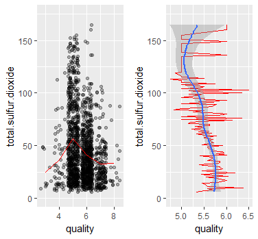

闅忕潃鎬讳簩姘у寲纭惈閲忓鍔狅紝骞冲潎璐ㄩ噺鏈夋墍鍑忓皬锛岃€岃川閲忎???5鐨勫钩鍧囦簩姘у寲纭惈閲忔渶楂樸????


### 浜屾哀鍖栫???
```{r,echo= FALSE}
#娓哥浜屾哀鍖栫～涓庢€讳簩姘у寲纭噺涔嬮棿鐨勫叧绯?0.6676665
cor.test(wine$free.sulfur.dioxide, wine$total.sulfur.dioxide, method = "pearson")

```


### 瀵嗗害鍜岃川閲忓垎鏋? 
```{r , echo=FALSE}
ds_q <- ggplot(data=wine,aes(x=density,y=quality))+
  geom_line(stat = 'summary', fun.y = mean, color='red')+
  geom_smooth()+
  coord_flip()

q_ds <- ggplot(data=wine,aes(x=quality,y=density))+
  geom_point(alpha = 0.3,position='jitter')+
  geom_line(stat = 'summary', fun.y = mean, color='red')

grid.newpage()
pushViewport(viewport(layout = grid.layout(1, 2)))
print(q_ds, vp=viewport(layout.pos.row=1, layout.pos.col=1))
print(ds_q, vp=viewport(layout.pos.row=1, layout.pos.col=2))


ggplot(data=wine,aes(x=factor(quality),y=density))+
  geom_boxplot()+
  stat_summary(fun.y = mean, geom = 'point', shape=4)

#鐩稿叧绯绘暟寰堜???-0.1749192 
cor.test(wine$quality, wine$density, method = "pearson")

```


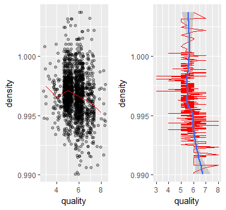

瀵嗗害浼间箮鍜岃川閲忎篃娌℃湁浠€涔堝叧绯伙紝涓嶈繃鎬讳綋瓒嬪娍锛岃川閲忓鍔狅紝瀵嗗害鏄笅闄嶈秼鍔跨殑????


### pH鍜岃川閲忓垎???? 
```{r , echo=FALSE}
ph_q <- ggplot(data=wine,aes(x=pH,y=quality))+
  geom_line(stat = 'summary', fun.y = mean, color='red')+
  geom_smooth()+
  coord_flip()

q_ph <- ggplot(data=wine,aes(x=quality,y=pH))+
  geom_point(alpha = 0.3,position='jitter')+
  geom_line(stat = 'summary', fun.y = mean, color='red')

grid.newpage()
pushViewport(viewport(layout = grid.layout(1, 2)))
print(q_ph, vp=viewport(layout.pos.row=1, layout.pos.col=1))
print(ph_q, vp=viewport(layout.pos.row=1, layout.pos.col=2))


ggplot(data=wine,aes(x=factor(quality),y=pH))+
  geom_boxplot()+
  stat_summary(fun.y = mean, geom = 'point', shape=4)

#鐩稿叧绯绘暟寰堜???-0.05773139 
cor.test(wine$quality, wine$pH, method = "pearson")

```


涓よ€呭嚑涔庢病鏈夌浉鍏虫€?


### 纭吀鐩愬拰璐ㄩ噺鍒嗘??? 
```{r , echo=FALSE}
su_q <- ggplot(data=wine,aes(x=sulphates,y=quality))+
  geom_line(stat = 'summary', fun.y = mean, color='red')+
  geom_smooth()+
  coord_flip()

q_su <- ggplot(data=wine,aes(x=quality,y=sulphates))+
  geom_point(alpha = 0.3,position='jitter')+
  geom_line(stat = 'summary', fun.y = mean, color='red')

grid.newpage()
pushViewport(viewport(layout = grid.layout(1, 2)))
print(q_su, vp=viewport(layout.pos.row=1, layout.pos.col=1))
print(su_q, vp=viewport(layout.pos.row=1, layout.pos.col=2))


ggplot(data=wine,aes(x=factor(quality),y=sulphates))+
  geom_boxplot()+
  stat_summary(fun.y = mean, geom = 'point', shape=4)

#鐩稿叧绯绘暟寰堜???0.2513971 
cor.test(wine$quality, wine$sulphates, method = "pearson")

```


闅忕潃璐ㄩ噺澧炲姞锛岀～閰哥洂鐨勫惈閲忎篃鍦ㄤ笂鍗囷紝涓よ€呭憟姝ｇ浉鍏筹紝鍙冲浘鍙互鐪嬪嚭锛屽湪纭吀鐩愭祿搴﹀???0.75宸﹀彸锛屽叾骞冲潎璐ㄩ噺鏈€澶э紝鍥犱负浠庡乏鍥剧湅鍑烘潵????0.75宸﹀彸锛岄珮璐ㄩ噺鐨勬暟閲忓鍔狅紝浣庤川閲忕殑鏁伴噺鍑忓皬????


### 閰掔簿鍚噺鍜岃川閲忓垎???? 
```{r , echo=FALSE}
al_q <- ggplot(data=wine,aes(x=alcohol,y=quality))+
  geom_line(stat = 'summary', fun.y = mean, color='red')+
  geom_smooth()+
  coord_flip()

q_al <- ggplot(data=wine,aes(x=quality,y=alcohol))+
  geom_point(alpha = 0.3,position='jitter')+
  geom_line(stat = 'summary', fun.y = mean, color='red')

grid.newpage()
pushViewport(viewport(layout = grid.layout(1, 2)))
print(q_al, vp=viewport(layout.pos.row=1, layout.pos.col=1))
print(al_q, vp=viewport(layout.pos.row=1, layout.pos.col=2))


ggplot(data=wine,aes(x=factor(quality),y=alcohol))+
  geom_boxplot()+
  stat_summary(fun.y = mean, geom = 'point', shape=4)

#鐩稿叧绯绘暟寰堜???0.4761663 
cor.test(wine$quality, wine$alcohol, method = "pearson")

```


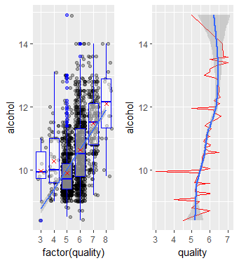

浠庡浘涓彲浠ョ湅鍑猴紝璐ㄩ噺澧炲姞锛屽钩鍧囬厭绮炬祿搴︿篃鍦ㄥ鍔狅紝閰掔簿娴撳害瓒婂ぇ锛屽钩鍧囪川閲忎篃鍦ㄨ秺澶э紝涓よ€呭憟姝ｇ浉鍏炽€?


### 鍙屽彉閲忓垎鏋愬皬缁?


## 澶氬彉閲忓垎????


## 瀹氱鍥句笌鎬荤???


## 鍙嶆????


