# 红葡萄酒量
### by 卢文娟
---

```{r prepare, echo=FALSE}
library(ggplot2)
library(GGally)
library(grid)
```

```{r load data, echo=FALSE}
# 加载数据
origin_wine <- read.csv('wineQualityReds.csv',sep=',')
#第一列没有什么用，删掉
wine <- origin_wine[,c(2:13)]

```


## 数据描述
```{r summary, echo=FALSE}
str(wine)
summary(wine)
#使用ggpairs绘制整体图,看不出什么。
ggpairs(wine)
```

'data.frame':	1599 obs. of  12 variables:
 $ fixed.acidity       : num  7.4 7.8 7.8 11.2 7.4 7.4 7.9 7.3 7.8 7.5 ...
 $ volatile.acidity    : num  0.7 0.88 0.76 0.28 0.7 0.66 0.6 0.65 0.58 0.5 ...
 $ citric.acid         : num  0 0 0.04 0.56 0 0 0.06 0 0.02 0.36 ...
 $ residual.sugar      : num  1.9 2.6 2.3 1.9 1.9 1.8 1.6 1.2 2 6.1 ...
 $ chlorides           : num  0.076 0.098 0.092 0.075 0.076 0.075 0.069 0.065 0.073 0.071 ...
 $ free.sulfur.dioxide : num  11 25 15 17 11 13 15 15 9 17 ...
 $ total.sulfur.dioxide: num  34 67 54 60 34 40 59 21 18 102 ...
 $ density             : num  0.998 0.997 0.997 0.998 0.998 ...
 $ pH                  : num  3.51 3.2 3.26 3.16 3.51 3.51 3.3 3.39 3.36 3.35 ...
 $ sulphates           : num  0.56 0.68 0.65 0.58 0.56 0.56 0.46 0.47 0.57 0.8 ...
 $ alcohol             : num  9.4 9.8 9.8 9.8 9.4 9.4 9.4 10 9.5 10.5 ...
 $ quality             : int  5 5 5 6 5 5 5 7 7 5 ...
 
数据集有1599个观察值和12个变量


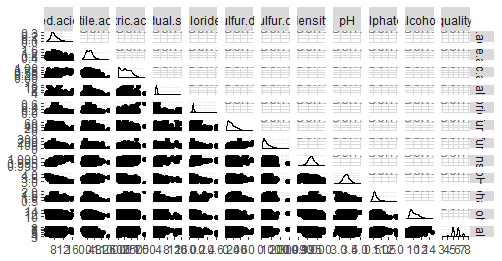

## 单变量分析

### 红酒质量分析
```{r quality, echo=FALSE}

ggplot(data=wine,aes(quality))+
  geom_histogram()

summary(wine$quality)
```

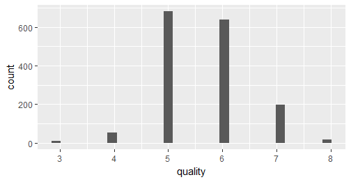

查看质量的柱形图，看出样本中质量的分布形状类似正态分布，质量分数中间的比较大

### 非挥发性酸
```{r fixed.acidity, echo=FALSE}

ggplot(data=wine,aes(fixed.acidity))+
  geom_histogram() +
  scale_x_continuous(breaks=c(4,5,6,7,8,9,10,11,12,13,15,16))

summary(wine$fixed.acidity)
```

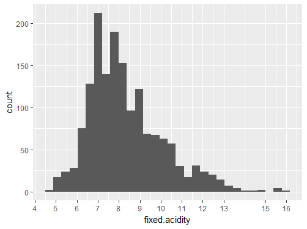

   Min. 1st Qu.  Median    Mean 3rd Qu.    Max. 
   4.60    7.10    7.90    8.32    9.20   15.90
   
非挥发性酸，在4.6g/dm^3到15.9g/dm^3之间，中位数是7.9g/dm^3，平均值是8.32g/dm^3。


### 挥发酸
```{r volatile.acidity, echo=FALSE}

ggplot(data=wine,aes(volatile.acidity))+
  geom_histogram()

summary(wine$volatile.acidity)
```
 
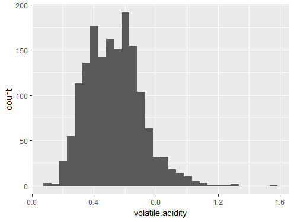

   Min. 1st Qu.  Median    Mean 3rd Qu.    Max. 
 0.1200  0.3900  0.5200  0.5278  0.6400  1.5800 

挥发性酸，在0.12g/dm^3到1.58g/dm^3之间，中位数是0.52g/dm^3，平均值是0.53g/dm^3。


### 柠檬酸
```{r citric.acid, echo=FALSE}

ggplot(data=wine,aes(citric.acid))+
  geom_histogram()

summary(wine$citric.acid)
```
 
 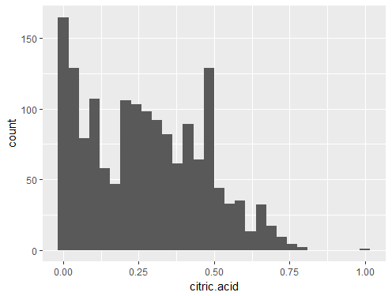

    Min. 1st Qu.  Median    Mean 3rd Qu.    Max. 
  0.000   0.090   0.260   0.271   0.420   1.000 

柠檬酸，在0g/dm^3到1g/dm^3之间，中位数是0.26g/dm^3，平均值是0.27g/dm^3。

三种酸，柠檬酸和挥发酸含量比非挥发酸含量少得多，挥发酸和非挥发酸都是类似正态的分布，柠檬酸含量低的偏多，含量高的偏少。

### 残留糖分
```{r residual.sugar, echo=FALSE}

ggplot(data=wine,aes(residual.sugar))+
  geom_histogram()

summary(wine$residual.sugar)
```

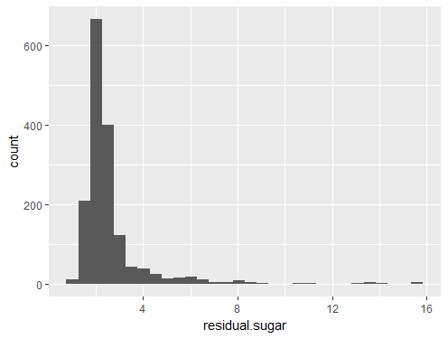

   Min. 1st Qu.  Median    Mean 3rd Qu.    Max. 
  0.900   1.900   2.200   2.539   2.600  15.500 

残留糖分，在0.9g/dm^3到15.5g/dm^3之间，中位数是2.2g/dm^3，平均值是2.54g/dm^3。
残留糖分呈现长尾分布，偏低的很多，偏高的很少，红酒残留糖分大部分都在2.6以下，从第三四分位数可以看出来10以上只有几个离散点，需要进一步分析。

### 氯化物
```{r chlorides, echo=FALSE}

ggplot(data=wine,aes(chlorides))+
  geom_histogram()

summary(wine$chlorides)
```

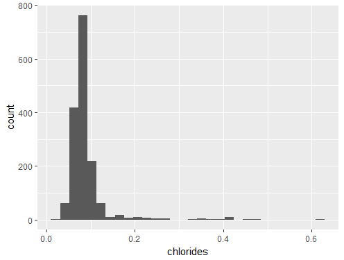

   Min. 1st Qu.  Median    Mean 3rd Qu.    Max. 
0.01200 0.07000 0.07900 0.08747 0.09000 0.61100 

氯化物，在0.012g/dm^3到0.611g/dm^3之间，中位数是0.079g/dm^3，平均值是0.087g/dm^3。

氯化物也呈现长尾分布，大部分都在0.09以下，0.3以上就只有几个离散点。


### 游离二氧化硫
```{r free.sulfur.dioxide, echo=FALSE}

ggplot(data=wine,aes(free.sulfur.dioxide))+
  geom_histogram()

summary(wine$free.sulfur.dioxide)
```

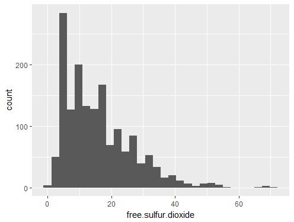

   Min. 1st Qu.  Median    Mean 3rd Qu.    Max. 
   1.00    7.00   14.00   15.87   21.00   72.00 

游离二氧化硫，在1mg/dm^3到72mg/dm^3之间，中位数是14mg/dm^3，平均值是15.87mg/dm^3。

### 总二氧化硫量
```{r total.sulfur.dioxide, echo=FALSE}

ggplot(data=wine,aes(total.sulfur.dioxide))+
  geom_histogram()
#排除异常值
ggplot(data=wine,aes(total.sulfur.dioxide))+
  geom_histogram()+
  scale_x_continuous(lim=c(0,200))

summary(wine$total.sulfur.dioxide)
```

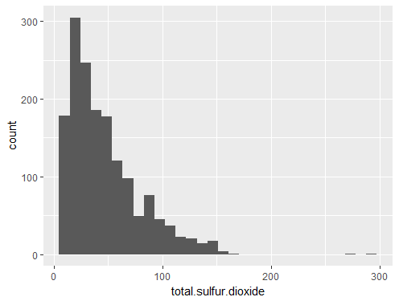

   Min. 1st Qu.  Median    Mean 3rd Qu.    Max. 
   6.00   22.00   38.00   46.47   62.00  289.00 

总二氧化硫量，在6mg/dm^3到289mg/dm^3之间，中位数是38mg/dm^3，平均值是46.47mg/dm^3。

经过查资料，游离二氧化硫和总二氧化硫是有关系的，总二氧化硫是游离二氧化硫和结合二氧化硫的综合，两者分布相似，含硫量低的偏多，含硫量越高的，数量越少，300左右有两个离散点，猜想是否是异常值。查资料发现，发酵酒的总二氧化硫含量不应超过250mg/dm^3,所以，将这些超标二氧化硫的红酒（或者说异常值）不是我们研究的范围，因此将异常值去掉。
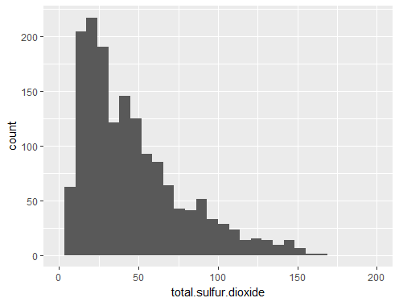


### 密度
```{r density, echo=FALSE}

ggplot(data=wine,aes(density))+
  geom_histogram()

summary(wine$density)
```

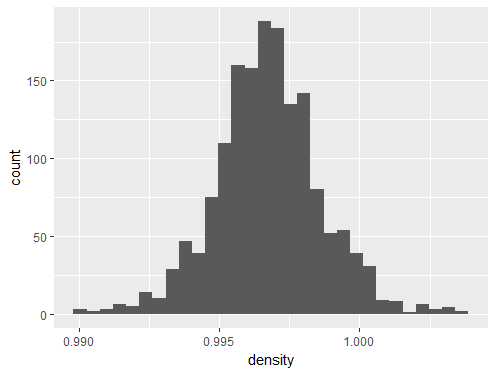

   Min. 1st Qu.  Median    Mean 3rd Qu.    Max. 
 0.9901  0.9956  0.9968  0.9967  0.9978  1.0037 
 
 密度，在0.99g/cm^3到1g/cm^3之间，中位数是0.9968g/cm^3，平均值是0.9967g/cm^3。
 
 密度也是呈现正态分布，红酒的密度都在1附近。
 
### pH
```{r pH, echo=FALSE}

ggplot(data=wine,aes(pH))+
  geom_histogram()

summary(wine$pH)
```
 
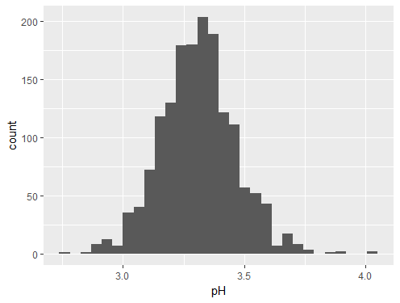
 
    Min. 1st Qu.  Median    Mean 3rd Qu.    Max. 
  2.740   3.210   3.310   3.311   3.400   4.010 
 
 
 pH，在2.74到4.01之间，中位数是3.31，平均值是3.311。
 可以看出ph呈酸性，酸性比较强，ph也呈近似正态分布
 
  
### 硫酸盐
```{r sulphates, echo=FALSE}

ggplot(data=wine,aes(sulphates))+
  geom_histogram()

summary(wine$sulphates)
```
 
 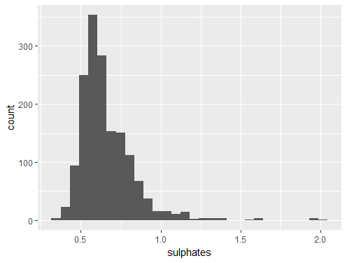
 
    Min. 1st Qu.  Median    Mean 3rd Qu.    Max. 
 0.3300  0.5500  0.6200  0.6581  0.7300  2.0000 
 
 硫酸盐，在0.33g/dm^3到2g/dm^3之间，中位数是0.62g/dm^3，平均值是0.658g/dm^3。
 硫酸盐，大部分在1.0以下，1.5以上就只有几个离散点。

### 酒精浓度
```{r alcohol, echo=FALSE}

ggplot(data=wine,aes(alcohol))+
  geom_histogram() +
  scale_x_continuous(breaks=c(8,9,10,11,12,13,15))

summary(wine$alcohol)
```

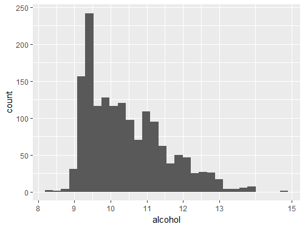

   Min. 1st Qu.  Median    Mean 3rd Qu.    Max. 
   8.40    9.50   10.20   10.42   11.10   14.90
酒精度数在8.4%到14.9%之间，中位数是10.2%，平均值是10.42%。

### 单变量分析小结
大部分变量都是呈现正态分布，一部分变量呈现长尾分布，而且长尾分布一部分点是离散的，所有变量在偏高的含量上都有几个偏离主要部分的特例离散点，不管是什么分布，是指红酒样本里，不管怎样都有某种含量超标的样本吗。


 
## 双变量分析
### 非挥发酸和质量分析
```{r , echo=FALSE}
fa_q <- ggplot(data=wine,aes(x=fixed.acidity,y=quality))+
  geom_line(stat = 'summary', fun.y = mean, color='red')+
  geom_smooth()+
  coord_flip()

q_fa <- ggplot(data=wine,aes(x=quality,y=fixed.acidity))+
  geom_point(alpha = 0.3,position='jitter')+
  geom_line(stat = 'summary', fun.y = mean, color='red')

grid.newpage()
pushViewport(viewport(layout = grid.layout(1, 2)))
print(q_fa, vp=viewport(layout.pos.row=1, layout.pos.col=1))
print(fa_q, vp=viewport(layout.pos.row=1, layout.pos.col=2))

#相关系数0.1240516 
cor.test(wine$quality, wine$fixed.acidity, method = "pearson")

```

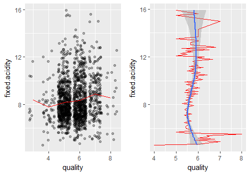

从图中可以看到，质量和非挥发酸的相关性可能有一点正相关，任何质量的红酒，其非挥发酸的含量都在8左右，但是趋势还是质量高的非挥发酸呈上升趋势，而且还可以看出，非挥发酸在较低值和较高值上其质量的波动比较大，而在中间值上，其质量相对比较稳定。总结来说，非挥发酸较高时，虽然质量波动比较大，但是质量还是大部分偏好的。


### 挥发酸和质量分析
```{r , echo=FALSE}
va_q <- ggplot(data=wine,aes(x=volatile.acidity,y=quality))+
  geom_line(stat = 'summary', fun.y = mean, color='red')+
  geom_smooth()+
  coord_flip()

q_va <- ggplot(data=wine,aes(x=factor(quality),y=volatile.acidity))+
  geom_point(alpha = 0.3,position='jitter')+
  geom_boxplot( alpha = 0.5,color = 'blue')+
  geom_smooth(method='lm', aes(group = 1))+
  stat_summary(fun.y = mean, geom = 'point', color = "red",shape=4)

grid.newpage()
pushViewport(viewport(layout = grid.layout(1, 2)))
print(q_va, vp=viewport(layout.pos.row=1, layout.pos.col=1))
print(va_q, vp=viewport(layout.pos.row=1, layout.pos.col=2))


#相关系数-0.3905578  
cor.test(wine$quality, wine$volatile.acidity, method = "pearson")

```

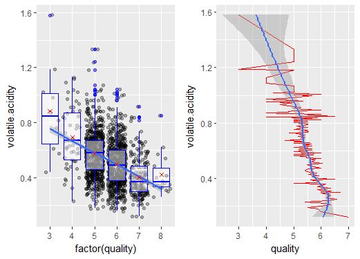


从图中可以看出，挥发酸和质量有比较清晰的负相关，质量越高，挥发酸的平均含量是越低的，挥发酸较低时，其平均质量较高，从箱线图看出挥发酸的异常值质量是3。


### 柠檬酸和质量分析
```{r , echo=FALSE}
ca_q <- ggplot(data=wine,aes(x=citric.acid,y=quality))+
  geom_line(stat = 'summary', fun.y = mean, color='red')+
  geom_smooth()+
  coord_flip()

q_ca <- ggplot(data=wine,aes(x=quality,y=citric.acid))+
  geom_point(alpha = 0.3,position='jitter')+
  geom_line(stat = 'summary', fun.y = mean, color='red')

grid.newpage()
pushViewport(viewport(layout = grid.layout(1, 2)))
print(q_ca, vp=viewport(layout.pos.row=1, layout.pos.col=1))
print(ca_q, vp=viewport(layout.pos.row=1, layout.pos.col=2))


ggplot(data=wine,aes(x=factor(quality),y=citric.acid))+
  geom_boxplot()+
  stat_summary(fun.y = mean, geom = 'point', shape=4)

#相关系数0.2263725 
cor.test(wine$quality, wine$citric.acid, method = "pearson")

```


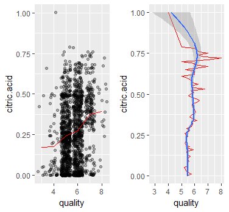

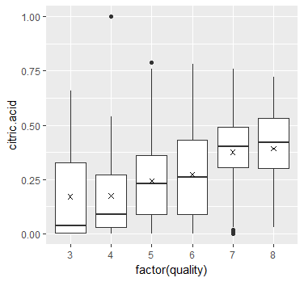

从左图可以看出，随着质量增加，柠檬酸的平均含量是增加的，成正相关，柠檬酸为1是一个异常点，忽略该异常值，各种含量的柠檬酸似乎平均质量也有一点点增长，但是差不多。


### 柠檬酸和其他酸
```{r,echo= FALSE}
#柠檬酸和非挥发酸之间的相关性，0.6717034 
cor.test(wine$fixed.acidity, wine$citric.acid, method = "pearson")
#柠檬酸和挥发酸之间的相关性，-0.5524957
cor.test(wine$volatile.acidity, wine$citric.acid, method = "pearson")

cor.test(wine$volatile.acidity, wine$fixed.acidity, method = "pearson")

cor.test(wine$fixed.acidity-wine$volatile.acidity, wine$citric.acid, method = "pearson")

wine$total.acidity <- wine$fixed.acidity+wine$volatile.acidity

ggplot(data=wine,aes(x=quality,y=total.acidity))+
  geom_point(alpha = 0.3,position='jitter')+
  geom_line(stat = 'summary', fun.y = mean, color='red')
```

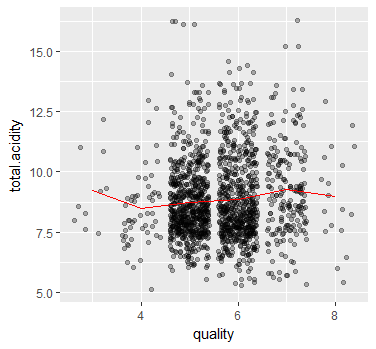

### 残留糖分和质量分析
```{r , echo=FALSE}
rs_q <- ggplot(data=wine,aes(x=residual.sugar,y=quality))+
  geom_line(stat = 'summary', fun.y = mean, color='red')+
  geom_smooth()+
  coord_flip()

q_rs <- ggplot(data=wine,aes(x=quality,y=residual.sugar))+
  geom_point(alpha = 0.3,position='jitter')+
  geom_line(stat = 'summary', fun.y = mean, color='red')

grid.newpage()
pushViewport(viewport(layout = grid.layout(1, 2)))
print(q_rs, vp=viewport(layout.pos.row=1, layout.pos.col=1))
print(rs_q, vp=viewport(layout.pos.row=1, layout.pos.col=2))


ggplot(data=wine,aes(x=factor(quality),y=residual.sugar))+
  geom_boxplot()+
  stat_summary(fun.y = mean, geom = 'point', shape=4)

#相关系数很0.01373164
cor.test(wine$quality, wine$residual.sugar, method = "pearson")

```

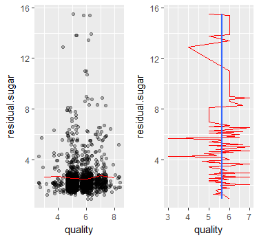

看起来没有什么相关性


### 氯化物和质量分析
```{r , echo=FALSE}
cl_q <- ggplot(data=wine,aes(x=chlorides,y=quality))+
  geom_line(stat = 'summary', fun.y = mean, color='red')+
  geom_smooth()+
  coord_flip()

q_cl <- ggplot(data=wine,aes(x=quality,y=chlorides))+
  geom_point(alpha = 0.3,position='jitter')+
  geom_line(stat = 'summary', fun.y = mean, color='red')

grid.newpage()
pushViewport(viewport(layout = grid.layout(1, 2)))
print(q_cl, vp=viewport(layout.pos.row=1, layout.pos.col=1))
print(cl_q, vp=viewport(layout.pos.row=1, layout.pos.col=2))


ggplot(data=wine,aes(x=factor(quality),y=chlorides))+
  geom_boxplot()+
  stat_summary(fun.y = mean, geom = 'point', shape=4)

#相关系数-0.1289066 
cor.test(wine$quality, wine$chlorides, method = "pearson")

```


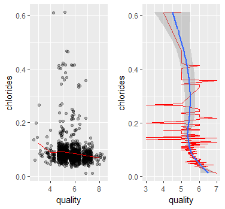

氯化物增加，平均质量主要呈下降趋势，但是质量的波动还是比较大的，质量增加，平均氯化物也呈下降趋势，两者成负相关。


### 游离二氧化硫和质量分析
```{r , echo=FALSE}
fsd_q <- ggplot(data=wine,aes(x=free.sulfur.dioxide,y=quality))+
  geom_line(stat = 'summary', fun.y = mean, color='red')+
  geom_smooth()+
  coord_flip()

q_fsd <- ggplot(data=wine,aes(x=quality,y=free.sulfur.dioxide))+
  geom_point(alpha = 0.3,position='jitter')+
  geom_line(stat = 'summary', fun.y = mean, color='red')

grid.newpage()
pushViewport(viewport(layout = grid.layout(1, 2)))
print(q_fsd, vp=viewport(layout.pos.row=1, layout.pos.col=1))
print(fsd_q, vp=viewport(layout.pos.row=1, layout.pos.col=2))


ggplot(data=wine,aes(x=factor(quality),y=free.sulfur.dioxide))+
  geom_boxplot()+
  stat_summary(fun.y = mean, geom = 'point', shape=4)

#相关系数-0.05065606
cor.test(wine$quality, wine$free.sulfur.dioxide, method = "pearson")

```

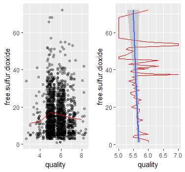

两者看起来没有什么相关性。在游离二氧化硫含量较大时，质量的波动比较大

### 总二氧化硫量和质量分析 去掉了异常
```{r , echo=FALSE}
tsd_q <- ggplot(data=wine,aes(x=total.sulfur.dioxide,y=quality))+
  scale_x_continuous(lim=c(0,175))+
  geom_line(stat = 'summary', fun.y = mean, color='red')+
  geom_smooth()+
  coord_flip()

q_tsd <- ggplot(data=wine,aes(x=quality,y=total.sulfur.dioxide))+
  scale_y_continuous(lim=c(0,175))+
  geom_point(alpha = 0.3,position='jitter')+
  geom_line(stat = 'summary', fun.y = mean, color='red')

grid.newpage()
pushViewport(viewport(layout = grid.layout(1, 2)))
print(q_tsd, vp=viewport(layout.pos.row=1, layout.pos.col=1))
print(tsd_q, vp=viewport(layout.pos.row=1, layout.pos.col=2))


ggplot(data=wine,aes(x=factor(quality),y=total.sulfur.dioxide))+
  geom_boxplot()+
  stat_summary(fun.y = mean, geom = 'point', shape=4)

#相关系数-0.1851003 
cor.test(wine$quality, wine$total.sulfur.dioxide, method = "pearson")

```


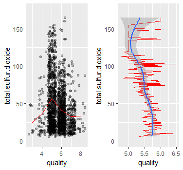

随着总二氧化硫含量增加，平均质量有所减小，而质量为5的平均二氧化硫含量最高。


### 二氧化硫
```{r,echo= FALSE}
#游离二氧化硫与总二氧化硫量之间的关系0.6676665
cor.test(wine$free.sulfur.dioxide, wine$total.sulfur.dioxide, method = "pearson")

cor.test(wine$quality, wine$total.sulfur.dioxide-wine$free.sulfur.dioxide, method = "pearson")
```


### 密度和质量分析
```{r , echo=FALSE}
ds_q <- ggplot(data=wine,aes(x=density,y=quality))+
  geom_line(stat = 'summary', fun.y = mean, color='red')+
  geom_smooth()+
  coord_flip()

q_ds <- ggplot(data=wine,aes(x=quality,y=density))+
  geom_point(alpha = 0.3,position='jitter')+
  geom_line(stat = 'summary', fun.y = mean, color='red')

grid.newpage()
pushViewport(viewport(layout = grid.layout(1, 2)))
print(q_ds, vp=viewport(layout.pos.row=1, layout.pos.col=1))
print(ds_q, vp=viewport(layout.pos.row=1, layout.pos.col=2))


ggplot(data=wine,aes(x=factor(quality),y=density))+
  geom_boxplot()+
  stat_summary(fun.y = mean, geom = 'point', shape=4)

#相关系数-0.1749192 
cor.test(wine$quality, wine$density, method = "pearson")

```


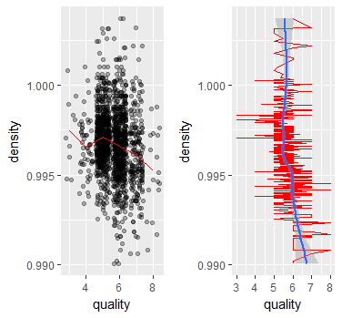

密度似乎和质量也没有什么关系，不过总体趋势，质量增加，密度是下降趋势的。


### pH和质量分析
```{r , echo=FALSE}
ph_q <- ggplot(data=wine,aes(x=pH,y=quality))+
  geom_line(stat = 'summary', fun.y = mean, color='red')+
  geom_smooth()+
  coord_flip()

q_ph <- ggplot(data=wine,aes(x=quality,y=pH))+
  geom_point(alpha = 0.3,position='jitter')+
  geom_line(stat = 'summary', fun.y = mean, color='red')

grid.newpage()
pushViewport(viewport(layout = grid.layout(1, 2)))
print(q_ph, vp=viewport(layout.pos.row=1, layout.pos.col=1))
print(ph_q, vp=viewport(layout.pos.row=1, layout.pos.col=2))


ggplot(data=wine,aes(x=factor(quality),y=pH))+
  geom_boxplot()+
  stat_summary(fun.y = mean, geom = 'point', shape=4)

#相关系数-0.05773139 
cor.test(wine$quality, wine$pH, method = "pearson")

```


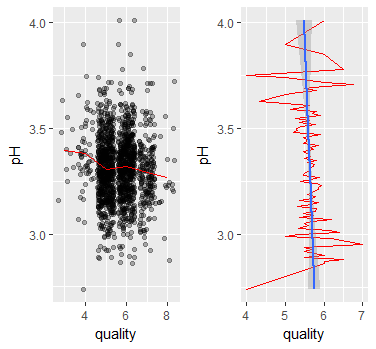

两者几乎没有相关性


### 硫酸盐和质量分析 
```{r , echo=FALSE}
su_q <- ggplot(data=wine,aes(x=sulphates,y=quality))+
  geom_line(stat = 'summary', fun.y = mean, color='red')+
  geom_smooth()+
  coord_flip()

q_su <- ggplot(data=wine,aes(x=quality,y=sulphates))+
  geom_point(alpha = 0.3,position='jitter')+
  geom_line(stat = 'summary', fun.y = mean, color='red')

grid.newpage()
pushViewport(viewport(layout = grid.layout(1, 2)))
print(q_su, vp=viewport(layout.pos.row=1, layout.pos.col=1))
print(su_q, vp=viewport(layout.pos.row=1, layout.pos.col=2))


ggplot(data=wine,aes(x=factor(quality),y=sulphates))+
  geom_boxplot()+
  stat_summary(fun.y = mean, geom = 'point', shape=4)

#相关系数0.2513971 
cor.test(wine$quality, wine$sulphates, method = "pearson")

```

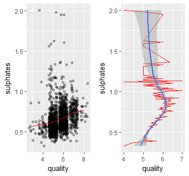

随着质量增加，硫酸盐的含量也在上升，两者呈正相关，右图可以看出，在硫酸盐浓度在0.75左右，其平均质量最大，因为从左图看出来在0.75左右，高质量的数量增加，低质量的数量减小。


### 酒精含量和质量分析
```{r , echo=FALSE}
al_q <- ggplot(data=wine,aes(x=alcohol,y=quality))+
  geom_line(stat = 'summary', fun.y = mean, color='red')+
  geom_smooth()+
  coord_flip()

q_al <- ggplot(data=wine,aes(x=factor(quality),y=alcohol))+
  geom_point(alpha = 0.3,position='jitter')+
  geom_boxplot( alpha = 0.5,color = 'blue')+
  geom_smooth(method='lm', aes(group = 1))+
  stat_summary(fun.y = mean, geom = 'point', color = "red",shape=4)
  

grid.newpage()
pushViewport(viewport(layout = grid.layout(1, 2)))
print(q_al, vp=viewport(layout.pos.row=1, layout.pos.col=1))
print(al_q, vp=viewport(layout.pos.row=1, layout.pos.col=2))


ggplot(data=wine,aes(x=factor(quality),y=alcohol))+
  geom_boxplot()+
  stat_summary(fun.y = mean, geom = 'point', shape=4)

#相关系数0.4761663 
cor.test(wine$quality, wine$alcohol, method = "pearson")

```


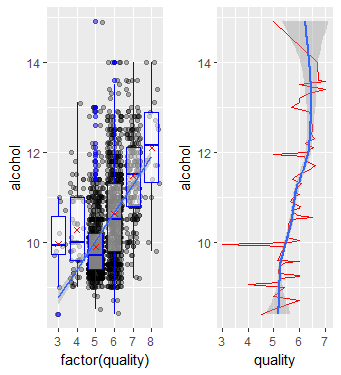

从图中可以看出，质量增加，平均酒精浓度也在增加，酒精浓度越大，平均质量也在越大，两者呈正相关。


### ph和非挥发酸的关系
```{r , echo=FALSE}

ggplot(data=wine,aes(x=pH,y=fixed.acidity))+
  geom_point(alpha = 0.3)+
  geom_smooth()

#相关系数-0.6829782 
cor.test(wine$pH, wine$fixed.acidity, method = "pearson")

```

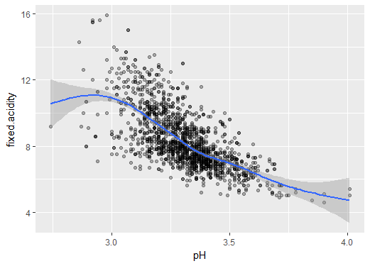

可以看出，ph与非挥发酸之间的关系是反相关的关系，应该是非挥发酸越大，ph越小，代表酸度越大。


### 双变量分析小结

  通过分析看出，红酒质量与酒精含量线性相关性最强（正相关），其次是挥发酸（负相关），与硫酸盐，柠檬酸的线性相关系数在0.2以上，与密度，总二氧化硫，氯化物，非挥发酸线性相关性在0.1以上，与残留糖分，游离二氧化硫，ph没有什么线性相关性。ph在两端时质量波动较大，游离二氧化硫较大时，质量的波动性较大。柠檬酸和非挥发酸之间的线性相关性很大，应该是有包含关系的，总二氧化硫和游离二氧化硫相关性也很大，也是有包含关系。密度和非挥发酸，以及Ph和非挥发酸之间都有很强的相关性。


## 多变量分析
### 密度，非挥发酸与质量的关系
```{r , echo=FALSE}

ggplot(data=wine,aes(x=density,y=fixed.acidity))+
   geom_point(aes(color=volatile.acidity))+
  facet_wrap(~quality)

```

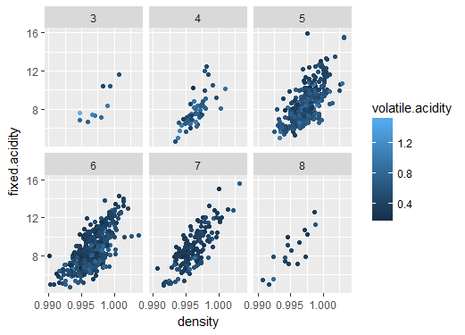

可以看出，不管任何质量的红酒，密度和非挥发酸之间都有比较相近的接近线性的关系。

### ph与非挥发酸，质量的关系
```{r , echo=FALSE}

ggplot(data=wine,aes(x=pH,y=fixed.acidity,color=factor(quality)))+
   geom_point(alpha=0.5,position='jitter')+
  geom_smooth(method = "lm", se = FALSE,size=1)+
  scale_color_brewer(palette = "Blues") 

```

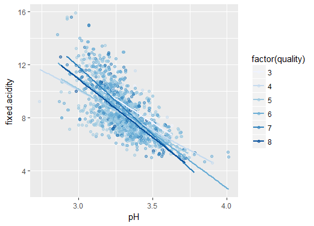

从图中可以看出，任何质量的红酒，密度和非挥发酸之间都有较强的线性反相关关系。

### 柠檬酸与非挥发酸，质量的关系
```{r , echo=FALSE}
ggplot(data=wine,aes(x=citric.acid,y=fixed.acidity,color=factor(quality)))+
   geom_point(alpha=0.5,position='jitter')+
  geom_smooth(method = "lm", se = FALSE,size=1)+
  scale_color_brewer(palette = "Blues") 

```

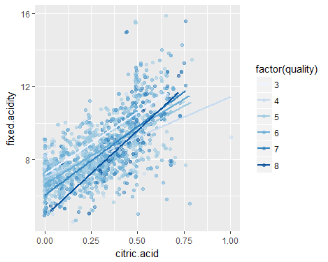

从图中可以看出，任何质量的红酒，柠檬酸与非挥发酸之间都有较强的线性正相关性。


### 总二氧化硫，游离二氧化硫和质量的关系

```{r , echo=FALSE}
ggplot(data=wine,aes(x=total.sulfur.dioxide,y=free.sulfur.dioxide,color=factor(quality)))+
   geom_point(alpha=0.5,position='jitter')+
  geom_smooth(method = "lm", se = FALSE,size=1)+
  scale_color_brewer(palette = "Blues") 

```

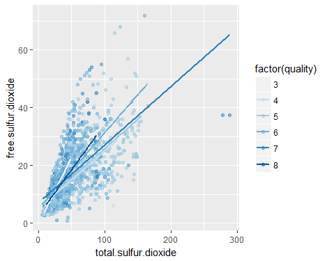

从图中可以看出，对于任意质量的红酒，总二氧化硫和游离二氧化硫之间都有较强的正相关关系。


### 硫酸盐，非挥发酸和质量之间的关系

```{r , echo=FALSE}
ggplot(data=wine,aes(x=sulphates,y=fixed.acidity,color=factor(quality)))+
  facet_wrap(~quality)+
   geom_point(alpha=0.5,position='jitter')
```


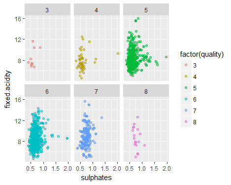

图中看出，在任何质量的红酒里，硫酸盐和非挥发酸之间几乎没有相关性。

### 酒精含量，挥发酸和质量之间的关系
```{r , echo=FALSE}
ggplot(data=wine,aes(x=alcohol,y=volatile.acidity,color=factor(quality)))+
  facet_wrap(~quality)+
   geom_point(alpha=0.5,position='jitter')
```


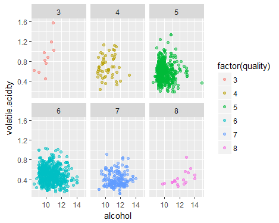

图中看出，在任何质量的红酒里，酒精含量和挥发酸之间几乎没有相关性。


### 非挥发酸，挥发酸和质量之间的关系
```{r , echo=FALSE}
ggplot(data=wine,aes(x=fixed.acidity,y=volatile.acidity,color=factor(quality)))+
  facet_wrap(~quality)+
   geom_point(alpha=0.5,position='jitter')
```

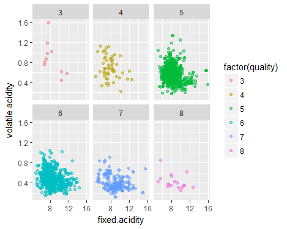

图中看出，在任何质量的红酒里，非挥发酸和挥发酸之间几乎没有相关性。


### 氯化物，挥发酸和质量之间的关系
```{r , echo=FALSE}
ggplot(data=wine,aes(x=chlorides,y=volatile.acidity,color=factor(quality)))+
  facet_wrap(~quality)+
   geom_point(alpha=0.5,position='jitter')
```


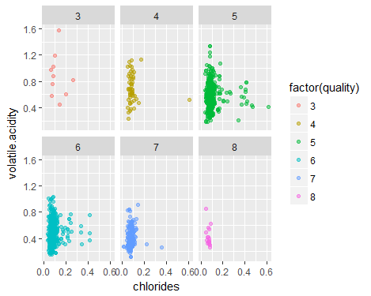

图中看出，在任何质量的红酒里，氯化物和挥发酸之间几乎没有相关性。

### 多变量关系小结
  通过多变量分析，可以看到，非挥发酸和柠檬酸，pH,密度之间有较强的相关性，总二氧化硫和游离二氧化硫有较强的相关性。pH，残留糖分，游离二氧化硫和质量的相关性不大；酒精含量，挥发酸，柠檬酸，非挥发酸，硫酸盐，氯化物，总二氧化硫，密度对质量均有一定影响，再综合特征之间的相关关联，估计酒精含量，挥发酸，（非挥发酸、柠檬酸，密度）之一，硫酸盐，氯化物，总二氧化硫的组合可以用于红酒质量的鉴定。

## 定稿图与总结


## 反思
  分析一个变量主要是分析它的分布以及是否有异常值，在分析两个变量之间的关系时，首先是用ggpair画图，看哪些变量之间有比较强的相关性，着重分析这些变量。相关性只能看出线性相关性，而非线性相关性看散点图也没有看出什么变化规律。分析一个变量以及两个变量都挺顺利的，但是分析三个变量时，总是要想很久才能勉强画出一幅图来表达变量之间的关系，往往忙活几个小时，也没有发现变量之间有什么更深层次的关系。也许是领域知识不够，红酒的质量应该是有其他量化的标准，或许是一些比例上的参数，但是也没能查到相关资料。
在机器学习中，主要是特征与结果之间的相关性，而特征之间的相关性则越小越好，所以，我在这两方面都进行了分析，也发现了一些强相关的特征，以及一些和酒精质量相关的特征。但是更多的组合特征或者非线性相关的特征并没有发现。


